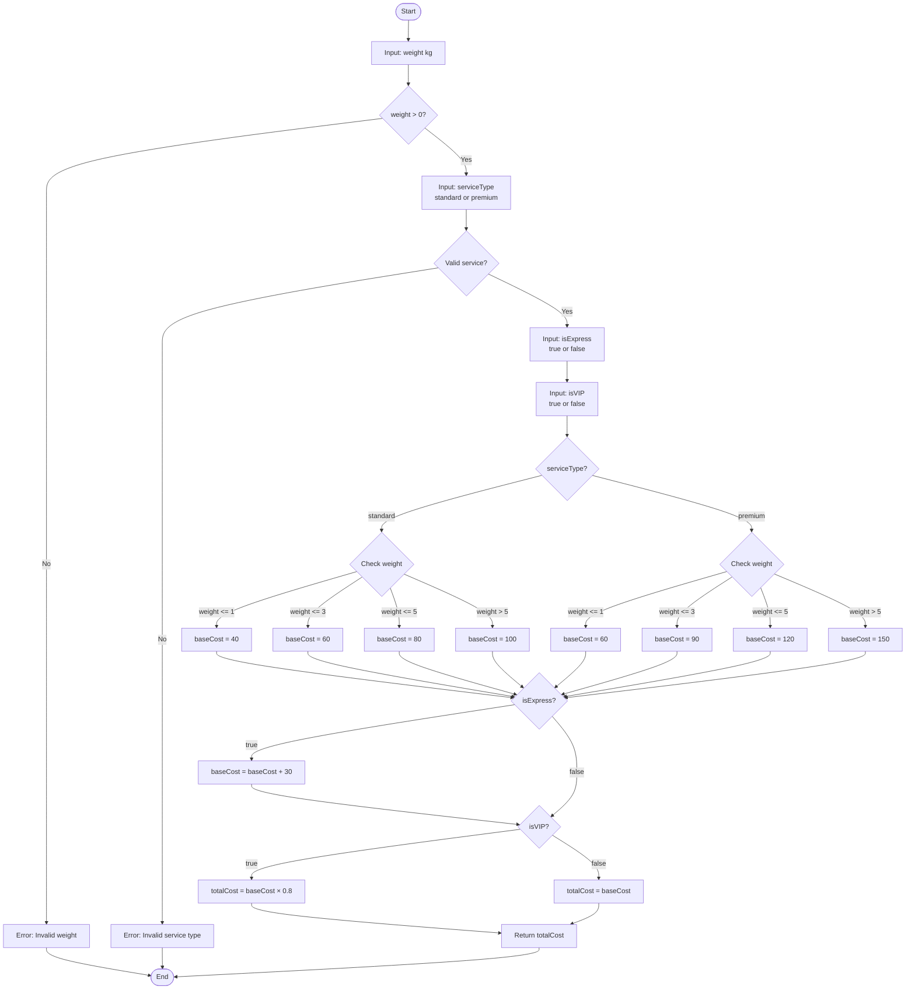

# Shipping Cost Calculator - Algorithm Documentation

## Flowchart



## Pseudocode

```
ALGORITHM calculateShippingCost(weight, serviceType, isExpress, isVIP)
BEGIN
    // Input validation
    IF weight <= 0 THEN
        THROW ERROR "Weight must be greater than 0"
    END IF
    
    // Initialize base cost
    SET baseCost = 0
    
    // Determine base cost by service type and weight
    IF serviceType == "standard" THEN
        IF weight <= 1 THEN
            SET baseCost = 40
        ELSE IF weight <= 3 THEN
            SET baseCost = 60
        ELSE IF weight <= 5 THEN
            SET baseCost = 80
        ELSE
            SET baseCost = 100
        END IF
    ELSE IF serviceType == "premium" THEN
        IF weight <= 1 THEN
            SET baseCost = 60
        ELSE IF weight <= 3 THEN
            SET baseCost = 90
        ELSE IF weight <= 5 THEN
            SET baseCost = 120
        ELSE
            SET baseCost = 150
        END IF
    ELSE
        THROW ERROR "Service type must be 'standard' or 'premium'"
    END IF
    
    // Add express service fee
    IF isExpress == true THEN
        SET baseCost = baseCost + 30
    END IF
    
    // Apply VIP discount
    IF isVIP == true THEN
        SET baseCost = baseCost × 0.8
    END IF
    
    // Return final cost
    RETURN baseCost
END
```

## Calculation Formula

```
totalCost = ((baseCost + expressFee) × vipDiscount)

Where:
- baseCost: Determined by service type and weight bracket
- expressFee: 30 if isExpress = true, else 0
- vipDiscount: 0.8 if isVIP = true, else 1.0
```

## Pricing Tables

### Standard Service
| Weight Range | Base Cost |
|--------------|-----------|
| 0–1 kg       | 40 baht   |
| >1–3 kg      | 60 baht   |
| >3–5 kg      | 80 baht   |
| >5 kg        | 100 baht  |

### Premium Service
| Weight Range | Base Cost |
|--------------|-----------|
| 0–1 kg       | 60 baht   |
| >1–3 kg      | 90 baht   |
| >3–5 kg      | 120 baht  |
| >5 kg        | 150 baht  |

### Additional Charges
- **Express Service**: +30 baht
- **VIP Member Discount**: -20% (multiply by 0.8)

## Example Calculations

### Example 1: Standard, No Express, No VIP
```
Input:  weight = 2.5 kg, serviceType = "standard", isExpress = false, isVIP = false
Step 1: baseCost = 60 (weight 2.5 is in >1–3 kg bracket)
Step 2: No express fee added
Step 3: No VIP discount
Output: 60 baht
```

### Example 2: Premium, Express, VIP
```
Input:  weight = 4 kg, serviceType = "premium", isExpress = true, isVIP = true
Step 1: baseCost = 120 (weight 4 is in >3–5 kg bracket)
Step 2: baseCost = 120 + 30 = 150 (express fee added)
Step 3: baseCost = 150 × 0.8 = 120 (VIP discount applied)
Output: 120 baht
```

### Example 3: Standard, Express, No VIP
```
Input:  weight = 6 kg, serviceType = "standard", isExpress = true, isVIP = false
Step 1: baseCost = 100 (weight 6 is in >5 kg bracket)
Step 2: baseCost = 100 + 30 = 130 (express fee added)
Step 3: No VIP discount
Output: 130 baht
```

## Time Complexity
- **O(1)** - Constant time complexity as all operations are conditional checks and arithmetic calculations

## Space Complexity
- **O(1)** - Constant space complexity as only a few variables are used
