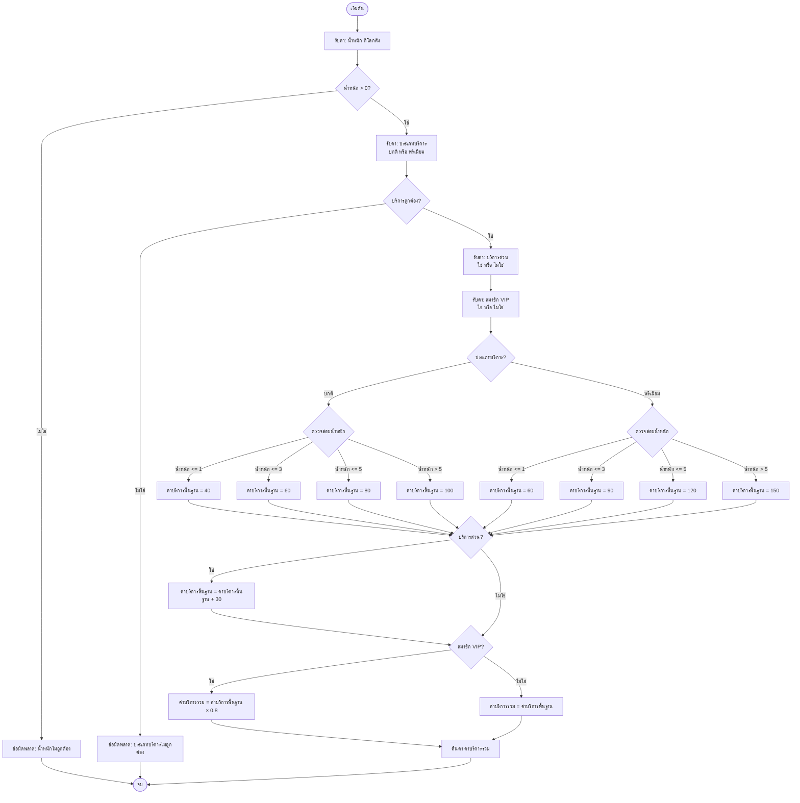

# ตัวคำนวณค่าจัดส่ง - เอกสารอัลกอริทึม

## ผังงาน (Flowchart)



## รหัสเทียม (Pseudocode)

```
อัลกอริทึม คำนวณค่าจัดส่ง(น้ำหนัก, ประเภทบริการ, บริการด่วน, สมาชิกVIP)
เริ่มต้น
    // ตรวจสอบความถูกต้องของข้อมูลนำเข้า
    ถ้า น้ำหนัก <= 0 แล้ว
        แสดงข้อผิดพลาด "น้ำหนักต้องมากกว่า 0"
    จบถ้า
    
    // กำหนดค่าเริ่มต้นของค่าบริการพื้นฐาน
    กำหนด ค่าบริการพื้นฐาน = 0
    
    // กำหนดค่าบริการพื้นฐานตามประเภทบริการและน้ำหนัก
    ถ้า ประเภทบริการ == "ปกติ" แล้ว
        ถ้า น้ำหนัก <= 1 แล้ว
            กำหนด ค่าบริการพื้นฐาน = 40
        มิฉะนั้น ถ้า น้ำหนัก <= 3 แล้ว
            กำหนด ค่าบริการพื้นฐาน = 60
        มิฉะนั้น ถ้า น้ำหนัก <= 5 แล้ว
            กำหนด ค่าบริการพื้นฐาน = 80
        มิฉะนั้น
            กำหนด ค่าบริการพื้นฐาน = 100
        จบถ้า
    มิฉะนั้น ถ้า ประเภทบริการ == "พรีเมียม" แล้ว
        ถ้า น้ำหนัก <= 1 แล้ว
            กำหนด ค่าบริการพื้นฐาน = 60
        มิฉะนั้น ถ้า น้ำหนัก <= 3 แล้ว
            กำหนด ค่าบริการพื้นฐาน = 90
        มิฉะนั้น ถ้า น้ำหนัก <= 5 แล้ว
            กำหนด ค่าบริการพื้นฐาน = 120
        มิฉะนั้น
            กำหนด ค่าบริการพื้นฐาน = 150
        จบถ้า
    มิฉะนั้น
        แสดงข้อผิดพลาด "ประเภทบริการต้องเป็น 'ปกติ' หรือ 'พรีเมียม'"
    จบถ้า
    
    // เพิ่มค่าบริการด่วน
    ถ้า บริการด่วน == จริง แล้ว
        กำหนด ค่าบริการพื้นฐาน = ค่าบริการพื้นฐาน + 30
    จบถ้า
    
    // ใช้ส่วนลดสมาชิก VIP
    ถ้า สมาชิกVIP == จริง แล้ว
        กำหนด ค่าบริการพื้นฐาน = ค่าบริการพื้นฐาน × 0.8
    จบถ้า
    
    // คืนค่าค่าบริการสุดท้าย
    คืนค่า ค่าบริการพื้นฐาน
จบ
```

## สูตรการคำนวณ

```
ค่าบริการรวม = ((ค่าบริการพื้นฐาน + ค่าบริการด่วน) × ส่วนลดVIP)

โดยที่:
- ค่าบริการพื้นฐาน: กำหนดตามประเภทบริการและช่วงน้ำหนัก
- ค่าบริการด่วน: 30 ถ้าเลือกบริการด่วน, ถ้าไม่เลือกเป็น 0
- ส่วนลดVIP: 0.8 ถ้าเป็นสมาชิก VIP, ถ้าไม่เป็นสมาชิกเป็น 1.0
```

## ตารางราคา

### บริการปกติ
| ช่วงน้ำหนัก      | ค่าบริการพื้นฐาน |
|------------------|------------------|
| 0–1 กิโลกรัม     | 40 บาท          |
| มากกว่า 1–3 กิโลกรัม | 60 บาท      |
| มากกว่า 3–5 กิโลกรัม | 80 บาท      |
| มากกว่า 5 กิโลกรัม   | 100 บาท     |

### บริการพรีเมียม
| ช่วงน้ำหนัก      | ค่าบริการพื้นฐาน |
|------------------|------------------|
| 0–1 กิโลกรัม     | 60 บาท          |
| มากกว่า 1–3 กิโลกรัม | 90 บาท      |
| มากกว่า 3–5 กิโลกรัม | 120 บาท     |
| มากกว่า 5 กิโลกรัม   | 150 บาท     |

### ค่าบริการเพิ่มเติม
- **บริการด่วน (Express)**: +30 บาท
- **ส่วนลดสมาชิก VIP**: -20% (คูณด้วย 0.8)

## ตัวอย่างการคำนวณ

### ตัวอย่างที่ 1: บริการปกติ, ไม่ใช้บริการด่วน, ไม่ใช่สมาชิก VIP
```
ข้อมูลนำเข้า:  น้ำหนัก = 2.5 กก., ประเภทบริการ = "ปกติ", บริการด่วน = ไม่ใช่, สมาชิกVIP = ไม่ใช่
ขั้นตอนที่ 1: ค่าบริการพื้นฐาน = 60 (น้ำหนัก 2.5 อยู่ในช่วงมากกว่า 1–3 กก.)
ขั้นตอนที่ 2: ไม่มีค่าบริการด่วน
ขั้นตอนที่ 3: ไม่มีส่วนลด VIP
ผลลัพธ์: 60 บาท
```

### ตัวอย่างที่ 2: บริการพรีเมียม, ใช้บริการด่วน, เป็นสมาชิก VIP
```
ข้อมูลนำเข้า:  น้ำหนัก = 4 กก., ประเภทบริการ = "พรีเมียม", บริการด่วน = ใช่, สมาชิกVIP = ใช่
ขั้นตอนที่ 1: ค่าบริการพื้นฐาน = 120 (น้ำหนัก 4 อยู่ในช่วงมากกว่า 3–5 กก.)
ขั้นตอนที่ 2: ค่าบริการพื้นฐาน = 120 + 30 = 150 (เพิ่มค่าบริการด่วน)
ขั้นตอนที่ 3: ค่าบริการพื้นฐาน = 150 × 0.8 = 120 (ใช้ส่วนลด VIP)
ผลลัพธ์: 120 บาท
```

### ตัวอย่างที่ 3: บริการปกติ, ใช้บริการด่วน, ไม่ใช่สมาชิก VIP
```
ข้อมูลนำเข้า:  น้ำหนัก = 6 กก., ประเภทบริการ = "ปกติ", บริการด่วน = ใช่, สมาชิกVIP = ไม่ใช่
ขั้นตอนที่ 1: ค่าบริการพื้นฐาน = 100 (น้ำหนัก 6 อยู่ในช่วงมากกว่า 5 กก.)
ขั้นตอนที่ 2: ค่าบริการพื้นฐาน = 100 + 30 = 130 (เพิ่มค่าบริการด่วน)
ขั้นตอนที่ 3: ไม่มีส่วนลด VIP
ผลลัพธ์: 130 บาท
```

## ความซับซ้อนของเวลา (Time Complexity)
- **O(1)** - ความซับซ้อนของเวลาคงที่ เนื่องจากการทำงานทั้งหมดเป็นการตรวจสอบเงื่อนไขและการคำนวณทางคณิตศาสตร์

## ความซับซ้อนของพื้นที่ (Space Complexity)
- **O(1)** - ความซับซ้อนของพื้นที่คงที่ เนื่องจากใช้ตัวแปรเพียงไม่กี่ตัว
